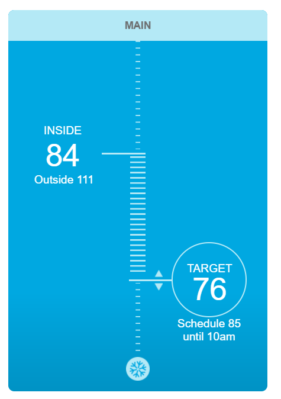

# nvenergy

## Who

This integration is for users of NV Energy's smart thermostat made by "TheSimple" which is accessed through ecofactor.com. The interface for this thermostat looks like:



## Installation

1. Using your tool of choice open the directory (folder) for your HA configuration (where you find `configuration.yaml`).
2. If you do not have a `custom_components` directory (folder) there, you need to create it.
3. In the `custom_components` directory (folder) create a new folder called `nvenergy`.
4. Download _all_ the files from the `custom_components/nvenergy/` directory (folder) in this repository.
5. Place the files you downloaded in the new directory (folder) you created.
6. Edit your `configuration.yaml` file placing in the configuration below.
6. Restart Home Assistant

## Configuration.yaml entry

```
climate:
  - platform: nvenergy
    username: "sample@user.com"
    password: "password goes here"
```

## Optional Config: Thermostat Names

The integration will pull a name from the NV Energy web interface. If you wish to change the provide name you can add parameters to your `configuration.yaml` entry.

If you have a single thermostat, add a `name:` parameter:

```
climate:
  - platform: nvenergy
    username: "sample@user.com"
    password: "password goes here"
	name: "My Thermostat"
```

If you have multiple thermostats you will need to run the interface letting it retrieve the default names, you will lookup the thermostat ID, then adjust the config to set
the thermostat names for the specific thermostat IDs.

To lookup thermostat IDs:
1. Follow the installation instructions so the integration is working.
2. Login to Home Assistant and select `Developer Tools` on the left menu.
3. Under `Current Entities` > `Filter entities` type: `climate`
4. Under `Attributes` for the listed climate entities, find and record `nve_thermostat_id`.

Once you have the thermostat ID's you can assign a name to the specific thermostat ID in `configuration.yaml`. Add `name_<thermostat id>`:

```
climate:
  - platform: nvenergy
    username: "sample@user.com"
    password: "password goes here"
	name_12345: "Thermostat One"
	name_67890: "Thermostat Two"
```

## Limitations

1. Supports multiple thermostats but only a single location.